#        <center>中山大学移动信息工程学院本科生实验报告</center>

####                                                               <center>(2017年秋季学期)</center>

### 课程名称:移动应用开发                                                          任课教师:郑贵锋

-------

|  姓名  |    学号    |  班级  |     电话      |        邮箱         |
| :--: | :------: | :--: | :---------: | :---------------: |
| 张子豪  | 15352427 | 15M1 | 15989046143 | ahzzh1998@163.com |

-----

### 1.实验题目

数据存储（一）

### 2.实现内容

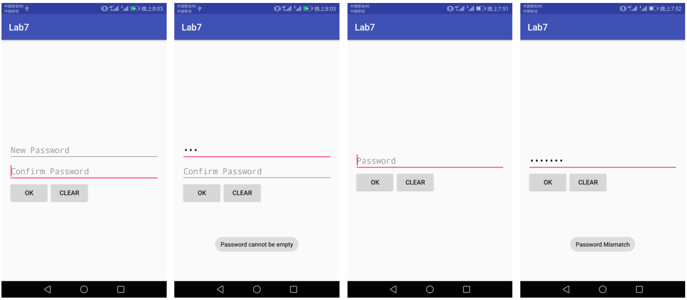

从左至右， 依次为：初始密码界面、密码为空提示、 密码匹配后重新进入界面、 密码错误提示 。

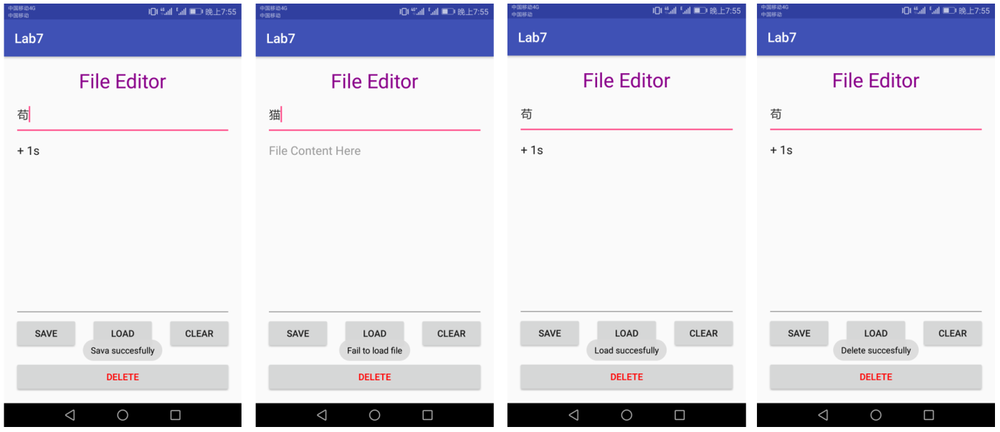

从左至右，依次为：保存成功提示、写入失败提示、 写入成功提示、删除成功提示 。

1. 如图所示，本次实验需要实现两个 activity 。
2. 首先，需要实现一个密码输入 activity ：
   1. 如果应用首次启动，则界面呈现出两个输入框，分别为新密码输入和确认密码输入框 ;
   2. 输入框下方有两个按钮 ：
      * OK 按钮，点击之后 ：
        * 若 new password 为空，则弹出密码为空的提示  ;
        * 若 new password 与 comfirm password 不匹配，则弹出不匹配的提示 ;
        * 若密码不为空且互相匹配，则保存密码，进入文件编辑界面 。
      * CLEAR 按钮，点击之后清除所有输入框的内容 
   3. 完成创建密码后，退出应用再进入应用，则只呈现一个密码输入框  ;
      * 点击 OK 按钮后，如果输入的密码与保存的密码不匹配，则弹出 Toast 提示 ;
      * 点击 CLEAR 按钮后，清除密码输入框的内容 。
   4. 出于学习的目的，我们使用 SharedPreferences 来保存密码，但是在实际应用中我们会用更加安全的机制来保存这些隐私信息
3. 然后，实现一个文件编辑 activity ：
   1. 界面底部有两行四个按钮， 第一行三个按钮高度一致，顶对齐，按钮水平均匀分布。 按钮上方除了 ActionBar 和 StatusBar 之外的空间由标题和两个 EditText 占据， 文件内容编辑的 EditText 需要占据除去其他控件的全部屏幕空间，且内部文字竖直方向置顶，左对齐 ;
   2. 在文件名输入框内输入文件名， 在文件内容编辑区域输入任意内容， 点击 SAVE 按钮后能够保存
      到指定文件，成功保存后弹出 Toast 提示 ;
   3. 点击 CLEAR 按钮，能够清空文件内容编辑区域内的内容 ;
   4. 点击 LOAD 按钮，能够按照文件名从内存中读取文件内容，并将文件内容写入到编辑框中。如果成功导入，则弹出成功的 Toast 提示， 如果导入失败（ 例如：文件不存在）， 则弹出读取失败的 Toast 提示
   5. 点击 DELETE 按钮，能够按照文件名从内容中删除文件，删除文件后再载入文件，弹出导入失败的 Toast 提示
4. 特殊要求：进入文件编辑的 Activity 之后，如果点击返回按钮，则直接返回 Home 界面，不再返回密码输入界面。

### 3.课堂实验结果

* 实验截图

  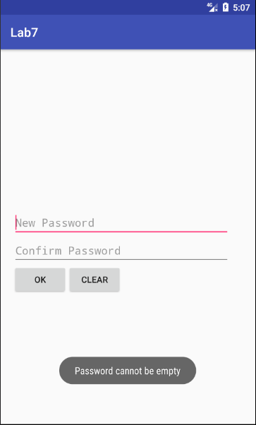

  第一次进入app后，界面如上，点击OK弹出密码不可为空提示

  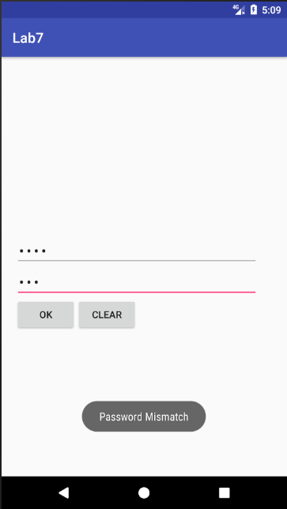

  密码不匹配时弹出Toast如上

  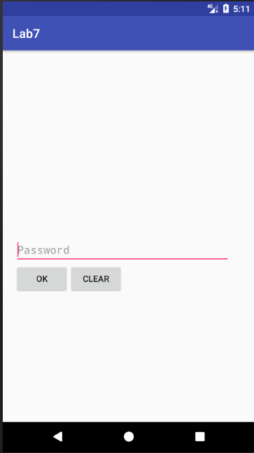

  当密码匹配相同时，保存密码，只显示一个输入框用来输入密码，如上，密码正确则进入编辑页面。

  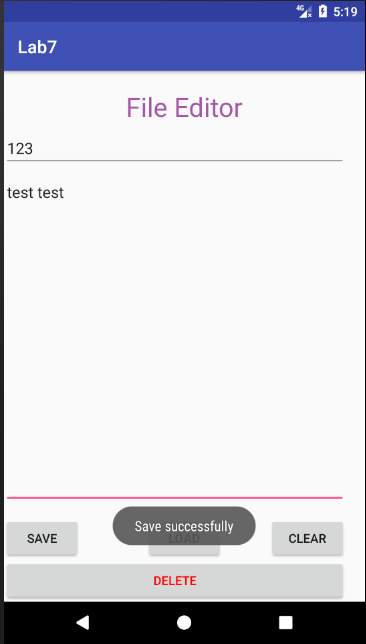

  进入编辑页面，输入文件名称和文件内容，点击SAVE保存

  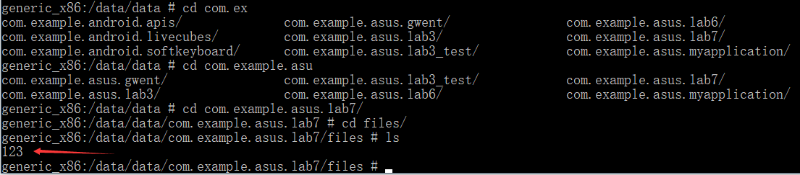

  root虚拟机后，使用adb shell进入虚拟机系统，然后可以在这个/data/data/lab7/files路径下看到我们保存的文件，如上

  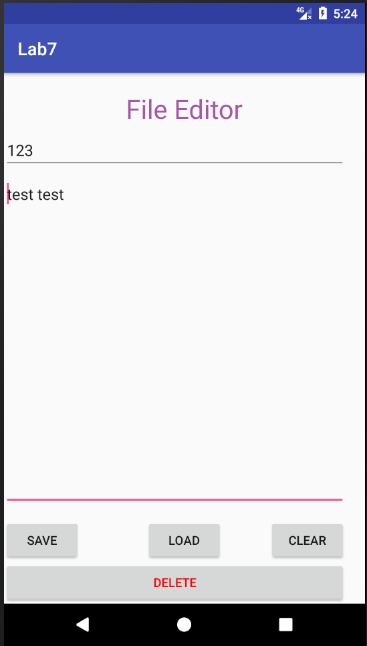

  使用LOAD成功加载文件

  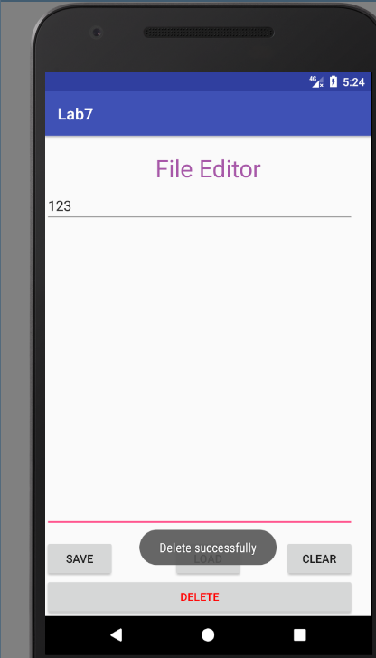

  使用DELETE删除文件，此时再去命令行中查看可以发现没有了这个文件

  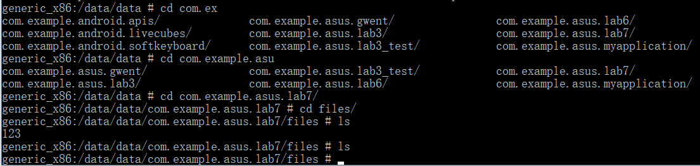

  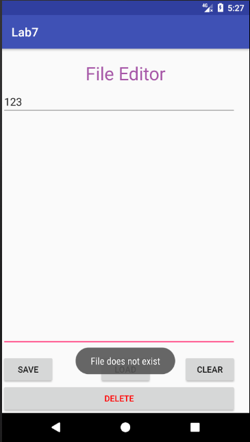

  并且LOAD加载失败。

* 实验步骤以及关键代码

  首先是判断是否第一次进入app，我认为这里应该是判断有没有成功创建密码，代码如下

  ```java
  password= getSharedPreferences("password", 0);
  String str_password=new String();
  str_password=password.getString("pass","default");
  if(str_password.equals("default")){ //尚未创建密码

  }
  else{ //已经创建密码，改变视图，隐藏一个输入框
      Change_View();
  }
  ```

  然后是输入密码界面的OK按钮点击处理，我利用了一个bool类型的flag变量来判断是否有创建密码来对应不同的处理方式

  ```java
  if(!flag){ //创建密码页面的OK按钮
      EditText editText1=(EditText)findViewById(R.id.edit1);
      EditText editText2=(EditText)findViewById(R.id.edit2);
      String input1,input2=new String();
      input1=editText1.getText().toString();
      input2=editText2.getText().toString();
      if(!input1.equals(input2)) Toast.makeText(MainActivity.this,"Password Mismatch",Toast.LENGTH_SHORT).show();
      else if(input1.length()==0) Toast.makeText(MainActivity.this,"Password cannot be empty",Toast.LENGTH_SHORT).show();
      else{
          SharedPreferences.Editor editor=password.edit();
          editor.putString("pass",input1);
          editor.commit();
          Change_View();
      }
  }
  else { //登录页面的OK按钮
      EditText editText2=(EditText)findViewById(R.id.edit2);
      String input,str_password=new String();
      input=editText2.getText().toString();
      str_password=password.getString("pass","default");
      if(input.length()==0) Toast.makeText(MainActivity.this,"Password cannot be empty",Toast.LENGTH_SHORT).show();
      else if(!input.equals(str_password)) Toast.makeText(MainActivity.this,"Password Mismatch",Toast.LENGTH_SHORT).show();
      else startActivity(new Intent("EditActivity")); //进入编辑页面
  }
  ```

  编辑页面的SAVE按钮点击处理，实现也比较简单，代码如下

  ```java
  EditText edit_title=(EditText)findViewById(R.id.title_edit);
  EditText edit_text=(EditText)findViewById(R.id.text_edit);
  String title,text=new String();
  title=edit_title.getText().toString();//获得文件名
  text=edit_text.getText().toString();//获得内容
  try(FileOutputStream fileOutputStream=openFileOutput(title,MODE_PRIVATE)){
      fileOutputStream.write(text.getBytes());
      fileOutputStream.flush();
      fileOutputStream.close();
  }
  catch (IOException ex){

  }
  Toast.makeText(EditActivity.this,"Save successfully",Toast.LENGTH_SHORT).show();
  ```

  编辑页面的LOAD按钮点击处理，代码如下

  ```java
  EditText edit_title=(EditText)findViewById(R.id.title_edit);
  EditText edit_text=(EditText)findViewById(R.id.text_edit);
  String title,text=new String();
  title=edit_title.getText().toString();//获取文件名
  try(FileInputStream fileInputStream=openFileInput(title)){
      int length=fileInputStream.available();
      byte[] buffer=new byte[length];
      StringBuilder sb = new StringBuilder("");
      int len = 0;
      //读取文件内容:
      while ((len = fileInputStream.read(buffer)) > 0) {
          sb.append(new String(buffer, 0, len));
      }
      fileInputStream.close();
      text=sb.toString();
      edit_text.setText(text);
  }
  catch (IOException ex){ //文件不存在
      Toast.makeText(EditActivity.this,"File does not exist",Toast.LENGTH_SHORT).show();
  }
  ```

  编辑页面的DELETE按钮点击处理

  ```java
  EditText edit_title=(EditText)findViewById(R.id.title_edit);
  String title=new String();
  title=edit_title.getText().toString();//获取文件名
  deleteFile(title);
  Toast.makeText(EditActivity.this,"Delete successfully",Toast.LENGTH_SHORT).show();
  ```

  编辑页面按返回键退出程序。这里需要注意到由于是从MainActivity进入这个Activity，也就是说MainActivity仍然在栈中，所以需要先将它finish掉。至于在其他的Activity中如何finish这个Activity，可以在MainActivity中进行如下定义：

  ```java
  public static MainActivity instance=null;
  ```

  然后在onCreate方法中为其赋值:

  ```java
  instance=MainActivity.this;
  ```

  最后在EditActivity中就可以调用它了，然后再finish掉EditActivity，最后exit(0)，暴力重写onBackPressed方法就可以了

  ```java
  @Override
  public void onBackPressed(){
      MainActivity.instance.finish();
      finish();
      System.exit(0);
  }
  ```


* 实验遇到困难以及解决思路

  无。（这个大作业接连来袭的一周安卓实验如此友好T T）
### 4.实验思考及感想

这次实验总体来说难度不大，了解到如何使用FileOutputStream和FileInputStream进行数据读写就可以了，SharedPreferences的使用也不算很难。

另外是Internal Storage 和 External Storage 的区别：前者一定存储在手机内部，而后者可能是通过USB存储模式挂载的外部存储器。前者一般来说只能被创建它的app访问（我前面那样root之后也可以访问），当该app被卸载时，Internal Storage的所有内容也会被删除；而后者可以被所有人访问，且app被卸载时系统仅仅会删external根目录（getExternalFilesDir()）下的相关文件。

显而易见，当我们需要某些文件不会被用户和其他app访问时候，使用Internal Storage 是最好的选择；当我们需要文件可以被其他app共享或者能够被用户访问时，那么使用External Storage就比较好。


作业要求:

1.命名要求：学号\_姓名\_ 实验编号，例如15330000\_林XX\_lab1。

2.实验报告提交格式为pdf。

3.实验内容不允许抄袭，我们要进行代码相似度对比。如发现抄袭，按0分处理。