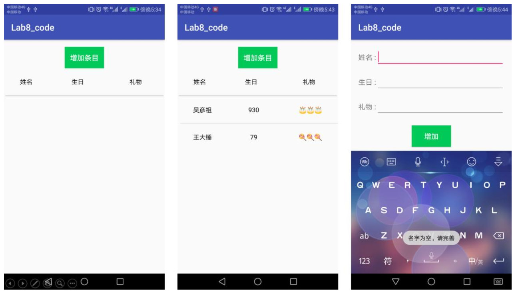
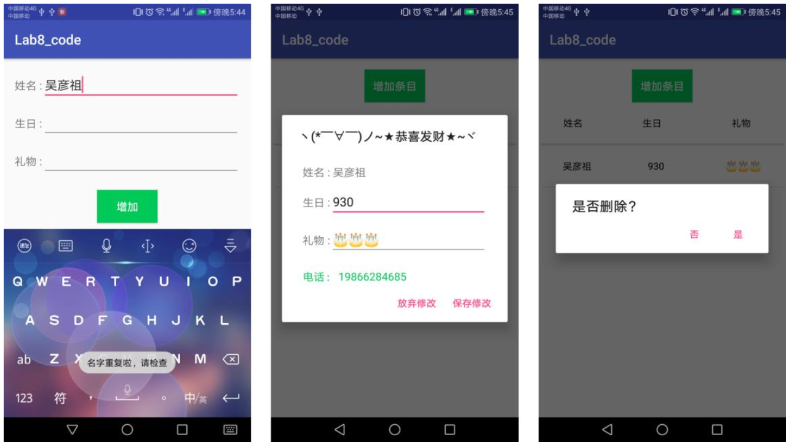
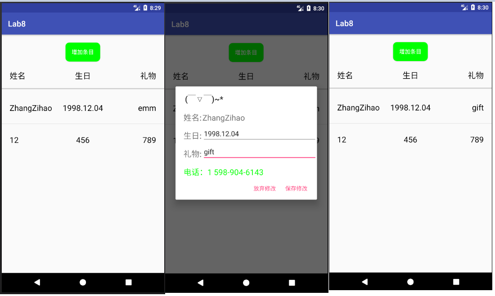
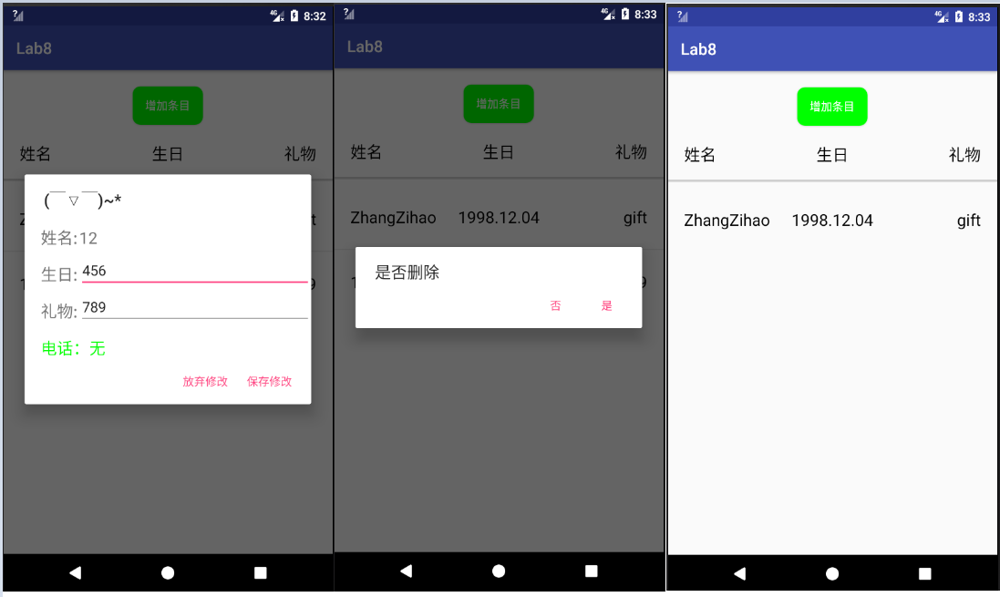
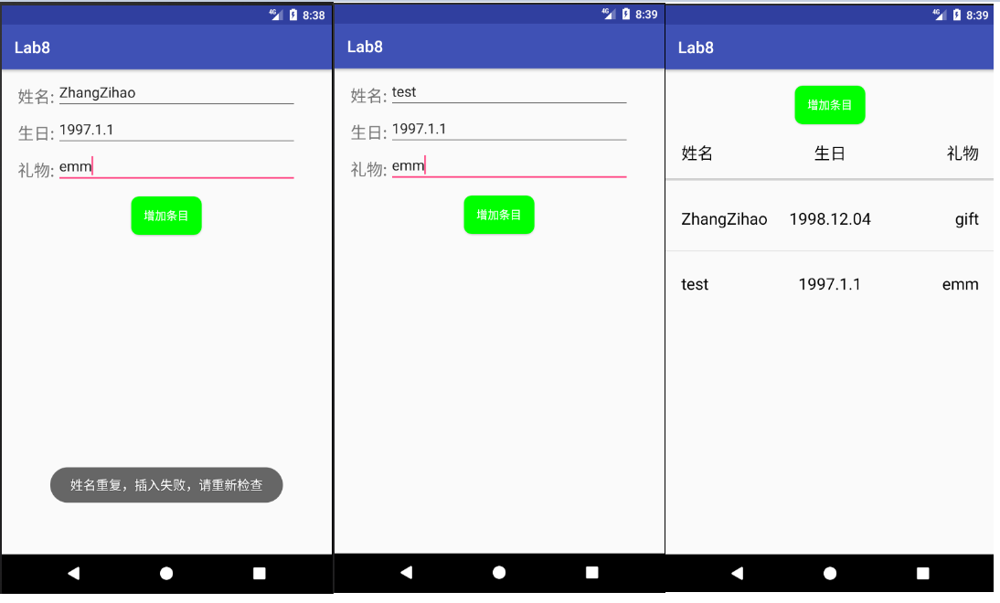

#        <center>中山大学移动信息工程学院本科生实验报告</center>

####                                                               <center>(2017年秋季学期)</center>

### 课程名称:移动应用开发                                                          任课教师:郑贵锋

-------

|  姓名  |    学号    |  班级  |     电话      |        邮箱         |
| :--: | :------: | :--: | :---------: | :---------------: |
| 张子豪  | 15352427 | 15M1 | 15989046143 | ahzzh1998@163.com |

-----

### 1.实验题目

数据存储（二）

### 2.实现内容



从左至右：初始界面，添加一部分条目， 名字不能为空 



从左至右：名字不能重复，点击条目显示信息（可修改）， 长按删除条目。 

实现一个生日备忘录， 要求实现： 

* 使用 SQLite 数据库保存生日的相关信息，并使得每一次运行程序都可以显示出已经存储在数据库里的内容；
* 使用 ContentProvider 来获取手机通讯录中的电话号码。

功能要求： 

1. 主界面包含增加生日条目按钮和生日信息列表； 

2. 点击“ 增加条目” 按钮，跳转到下一个 Activity 界面， 界面中包含三个信息输入框（姓名、生日、礼物） 和一个“增加” 按钮， **姓名字段不能为空且不能重复** ;

3. 在跳转到的界面中，输入生日的相关信息后， 点击“ 增加” 按钮返回到主界面， **此时，主界面中应更新列表，增加相应的生日信息** ;

4. 主界面列表点击事件： 

   * 点击条目： 

     弹出对话框，对话框中显示该条目的信息，并允许修改 ;
     对话框下方显示该寿星电话号码**（ 如果手机通讯录中有的话，如果没有就显示“ 无” ）** ;
     点击“保存修改” 按钮， 更新主界面生日信息列表。

   * 长按条目：

     弹出对话框显示是否删除条目 ;

     点击“ 是” 按钮，删除该条目，并更新主界面生日列表。

### 3.课堂实验结果

* 实验截图

  

  进入程序初始界面如上左图(已存在的两条记录是我实验过程中插入的)，中图为点击修改并保存，右图为修改完成后界面。

  

  对于手机通讯录中不存在的条目，电话会显示为无，如上左图所示，中图为长按删除并确定，右图为删除后的数据库。

  

  点击增加条目后进入新Activity，输入姓名、生日、礼物插入数据库，姓名重复时插入失败，如上左图所示，修改姓名后重新插入，如上中、右图所示。

* 实验步骤以及关键代码

  1. 数据库的创建

     自定义一个继承了SQLiteOpenHelper类的子类MyDatabase，对于这个子类我们需要重写构造函数、onCreate方法、onUpgrade方法才能让它实例化。

     构造函数如下，支持只传入context、数据库名称、数据库版本 或 只传入context和数据库名称来实例化。

     ```java
     public MyDatabase(Context context, String name, SQLiteDatabase.CursorFactory factory, int version) {
             super(context, name, factory, version);
         }
         public MyDatabase(Context context, String name,int version){
             this(context,name,null,version);
         }
         public MyDatabase(Context context,String name){
             this(context,name,null,DB_VERSION);
         }
     ```

     重写onCreate方法，在数据库中建表，含有name、birth、gift三列。

     ```java
     @Override
         public void onCreate(SQLiteDatabase db) {
             String CREATE_TABLE = "create table " + Table_name
                     + " ("
                     + "name text primary key, "
                     + "birth text , "
                     + "gift text);";
             db.execSQL(CREATE_TABLE);

         }
     ```

     由于这次实验中不需要对数据库进行升级，因此用不到onUpgrade方法，留空即可。

  2. 读取数据库内容并显示

     使用ListView来显示数据库中的每条内容，ListView在前几次实验中已经使用过，因此主要要做的是数据库的查询。使用rawQuery执行`select * from table_name` 来获得一个指向整个表的游标cursor，通过moveToFirst方法的返回值来判断表是否为空，不空则循环移动光标来获得整个表的数据。我写了一个更新ListView的函数，每次执行查询表来更新ListView。执行数据库操作前需要先用`getWritableDatabase()` 来获得一个读写数据库的对象。

     ```java
     public void UpdateListview(){ //读取数据库来更新界面的ListView
         SQLiteDatabase db=myDatabase.getWritableDatabase();
         Cursor cursor=db.rawQuery("select * from "+MyDatabase.Table_name,null);
         if(cursor.moveToFirst()==false) return;
         else{
             list.clear();
             do{
                 int name_index=cursor.getColumnIndex("name");
                 String name=cursor.getString(name_index);
                 int birth_index=cursor.getColumnIndex("birth");
                 String birth=cursor.getString(birth_index);
                 int gift_index=cursor.getColumnIndex("gift");
                 String gift=cursor.getString(gift_index);
                 Map<String,String> tmp=new HashMap<>();
                 tmp.put("name",name);
                 tmp.put("birth",birth);
                 tmp.put("gift",gift);
                 list.add(tmp);
             }while (cursor.moveToNext());
             simpleAdapter.notifyDataSetChanged();
         }
     }
     ```

  3. 数据库增删改

     * 增

       增加数据需要判断name是否重复，但是我在建表的过程中将name设为主键且约束unique，然后实验过程中发现name重复依然可以添加，就很迷......最后换了一种方法，插入前先遍历一遍表单来确认有没有重复的name，如果有重复则不执行插入并弹出Toast。

       ```java
       public boolean insert(String name,String birth,String gift){ 
           SQLiteDatabase db=getWritableDatabase();
           ContentValues values=new ContentValues();
           values.put("name",name);
           values.put("birth",birth);
           values.put("gift",gift);
           Cursor cursor=db.rawQuery("select * from "+MyDatabase.Table_name,null);
           if(cursor.moveToFirst()==false) {
               db.insert(Table_name,null,values);
               db.close();
               return true;
           }
           else {
               boolean flag=false;
               do{
                   int name_index=cursor.getColumnIndex("name");
                   String name_tmp=cursor.getString(name_index);
                   if(name_tmp.equals(name)){ //存在相同name
                       flag=true;
                       break;
                   }
               }while (cursor.moveToNext());
               if(!flag){
                   db.insert(Table_name,null,values);
                   db.close();
                   return true;
               }
           }
           return false;
       }
       ```

     * 删

       同样的，获得读写数据库的对象后调用delete根据主键删除即可。

       ```java
       public void delete(String name){
           SQLiteDatabase db=getWritableDatabase();
           String whereClause= "name=?";
           String[] whereArgs={name};
           db.delete(Table_name,whereClause,whereArgs);
       }
       ```

     * 改

       方法与上相同，只不过调用的方法是update。

       ```java
       public void update(String name,String birth,String gift){
           SQLiteDatabase db=getWritableDatabase();
           String whereClause= "name=?";
           String[] whereArgs={name};
           ContentValues values=new ContentValues();
           values.put("name",name);
           values.put("birth",birth);
           values.put("gift",gift);
           db.update(Table_name,values,whereClause,whereArgs);
       }
       ```

  4. 读取手机通讯录与数据库中的姓名匹配

     AndroidManifest中添加权限读取通讯录，对于高API手机还需要去设置中手动开启获取通讯录的权限

     ```xml
     <uses-permission android:name="android.permission.READ_CONTACTS"/>
     ```

     然后获得一个指向通讯录集合的游标

     ```java
     Cursor contacts;
     contacts=getContentResolver().query(ContactsContract.Contacts.CONTENT_URI,null,null,null,null);
     ```

     之后可以通过这个contacts游标遍历通讯录。首先获得游标当前指向的那一行的contactID，然后通过这个ID来获得一个指向这个ID对应用户的所有电话号码(比如手机里存的Mobile、Home、Company等所有号码)的游标，通过这个游标遍历电话号码集合即可获得电话号码。

     ```java
     if(contacts.moveToFirst()==false){
         number.setText("电话：无");
     }
     else{
         boolean flag=false;
         do{
             String contactId = contacts.getString(contacts.getColumnIndex(ContactsContract.Contacts._ID));
             Cursor phone = getContentResolver().query(ContactsContract.CommonDataKinds.Phone.CONTENT_URI, null, ContactsContract.CommonDataKinds.Phone.CONTACT_ID + "=" + contactId, null, null);
             String Number = "";//通讯录中该行数据的电话号码
             while(phone.moveToNext()) {
                 Number += phone.getString(phone.getColumnIndex(ContactsContract.CommonDataKinds.Phone.NUMBER)) + " ";
             }
           	//获取通讯录中该行数据的姓名
             String username = contacts.getString(contacts.getColumnIndex(ContactsContract.Contacts.DISPLAY_NAME));
             if(username.equals(name)){
                 flag=true;
                 number.setText("电话："+Number);
             }
         }while (contacts.moveToNext());//遍历通讯录
         if(!flag) number.setText("电话：无");
     }
     ```

  5. 增加条目的页面返回上一个Activity后更新ListView

     由于是使用finish结束AddInfoActivity，结束后MainActivity会从栈中重新加载，因此重写MainActivity的onRestart方法即可。

     ```java
     @Override
      public void onRestart(){
          super.onRestart();
          UpdateListview();
      }
     ```

* 实验遇到困难以及解决思路

  1. 查询数据库的时候第一个数据查询不到。

     答：由于我使用了moveToFirst来查询数据库是否为空，之后是使用while(cursor.moveToNext())来遍历数据库，那么在查询之前就先执行了一次moveToNext，所以第一行数据被跳过去了。使用do-while结构即可解决这个问题。
### 4.实验思考及感想

经过这次实验，我对于Android平台中使用数据库存储数据有了一定了解，数据库在增删查改方面都比使用文件存储要方便的多。由于期中project中已经实现过数据库，因此这次实验难度并不大。


作业要求:

1.命名要求：学号\_姓名\_ 实验编号，例如15330000\_林XX\_lab1。

2.实验报告提交格式为pdf。

3.实验内容不允许抄袭，我们要进行代码相似度对比。如发现抄袭，按0分处理。