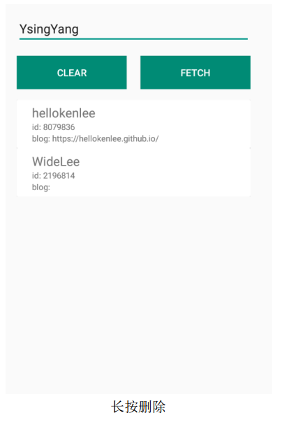
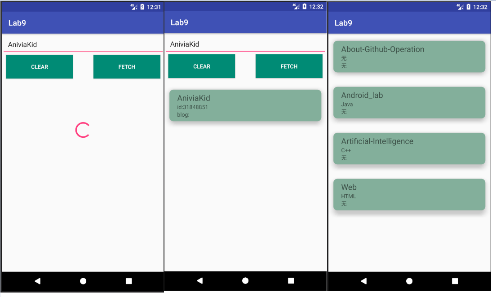

#        <center>中山大学移动信息工程学院本科生实验报告</center>

####                                                               <center>(2017年秋季学期)</center>

### 课程名称:移动应用开发                                                          任课教师:郑贵锋

-------

|  姓名  |    学号    |  班级  |     电话      |        邮箱         |
| :--: | :------: | :--: | :---------: | :---------------: |
| 张子豪  | 15352427 | 15M1 | 15989046143 | ahzzh1998@163.com |

-----

### 1.实验题目

Retrofit+RxJava+OkHttp 实现网络请求

### 2.实现内容





对于 User Model, 显示 id, login, blog 

对于 Repository Model, 显示 name, description, language

(特别注意， 如果 description 对于 1 行要用省略号代替) 

### 3.课堂实验结果

* 实验截图

  

  上图依次为请求用户过程中、请求结果、点击请求仓库信息；

  请求HelloKenLee用户如下

  

* 实验步骤以及关键代码

  1. 网络访问

     以访问https://api.github.com/users/AniviaKid 为例，请求会将Json 数据转化为 Java 实体类，因此我们需要定义接受数据的模板类，考虑到后面还要访问仓库信息，因此将二者写在了一个类里，读取时各自读取即可。

     ```java
     public class Github {
         private String login;//用户
         private String blog;//用户
         private int id;//用户
         private String name;//仓库
         private String language;//仓库
         private String description;//仓库
         public String getLogin(){return login;}
         public String getBlog(){return blog;}
         public int getId(){return id;}
         public String getName(){return name;}
         public String getLanguage(){return language;}
         public String getDescription(){return description;}
     }
     ```

     然后是构造Retrofit对象实现网络访问，考虑到要用两种接口分别访问用户信息和仓库信息，因此写了一个模板类。仅作实验用，因此没有对OkHttpClient设置Timeout属性，只调用Builder返回OkhttpClient对象。

     ```java
     public class ServiceGenerator {
         public static final String API_BASE_URL = "https://api.github.com";

         private static OkHttpClient.Builder httpClient = new OkHttpClient.Builder();

         private static Retrofit.Builder builder =
                 new Retrofit.Builder()
                         .baseUrl(API_BASE_URL)
                         .addConverterFactory(GsonConverterFactory.create())
                         .addCallAdapterFactory(RxJavaCallAdapterFactory.create());

         public static <S> S createService(Class<S> serviceClass) {
             Retrofit retrofit = builder.client(httpClient.build()).build();
             return retrofit.create(serviceClass);
         }
     }
     ```

     然后创建接口，以访问用户信息为例，@GET指发送一个GET请求，请求地址为baseUrl+ "/users/{user}"，{user} 类似于占位符的作用，具体值由getUser(@Path("user") String user) 指定，这里表示 {user} 将是一段字符串。

     ```java
     public interface GithubInterface{
             @GET("/users/{user}")
             Observable<Github> getUser(@Path("user") String user);
         }
     ```

     Retrofit 提供了RxJava形式的API接口，将请求封装进了Observable作为被观察者，请求结束后执行回调方法，下面会详细说明。

     接下来则是使用RxJava来完成网络访问。

     RxJava是一个很典型的异步过程，通过扩展的观察者模式来完成异步过程。Observable作为被观察者，当发生特定事件后，发送消息给订阅它的观察者Observer。这次实验中我们使用的Subscriber实际上是Observer的抽象类，进行了一些接口的扩展。

     当拥有了Observable(被观察者)和Observer(观察者)之后，使用subscribe()函数完成订阅即可，代码形式如下

     ```
     Observable.subscribe(Observer)
     //或者
     Observable.subscribe(Subscriber)
     ```

     事件触发后，观察者Observer接受到消息，执行回调过程。整个过程中对象间的关系如下

     

     个人认为RxJava的精髓在于线程控制，就我们这次实验要做的网络请求来说，假如作为一个面向市场的产品，一次要请求的数据量很大或者要同时执行其他操作(如将请求到的数据与数据库进行对比)，按照传统的做法，先请求数据，然后再显示到VIew上，这对于用户的体验无疑是极差的(有大半时间浪费在网络请求上)。

     那么，将让网络请求放在一个子线程，而将数据加载到界面设置在主线程，这就意味着即使网络请求花费了几十秒的时间，也不会造成界面的卡顿，不影响用户其他操作。

     `subscribeOn`设置`Observable.OnSubscribe`被激活时所处的线程，对应于实验中的getUser，也就是网络请求；`observeOn`设置Subscriber所运行在的线程，对应于实验中的onNext()和onCompleted()回调方法。按照下面的代码，则是将网络请求放在子线程，将onNext()和onCompleted()放在安卓主线程。

     ```java
     Observable.getUser(name)
               .subscribeOn(Schedulers.newThread())
               .observeOn(AndroidSchedulers.mainThread())
     ```

     完整的网络请求部分的代码如下，对于onCompleted和onError，二者互斥，也就是说调用了onCompleted之后就不会再调用onError，反之亦然。

     ```java
     GithubInterface githubInterface=ServiceGenerator.createService(GithubInterface.class);
     githubInterface.getUser(name)
         .subscribeOn(Schedulers.newThread())
         .observeOn(AndroidSchedulers.mainThread())
         .subscribe(new Subscriber<Github>() {
             @Override
             public void onCompleted() {
                 findViewById(R.id.user_mode_view).setVisibility(View.VISIBLE);//View显示
                 findViewById(R.id.user_progressbar).setVisibility(View.GONE);//进度条消失
             }

             @Override
             public void onError(Throwable e) {

             }

             @Override
             public void onNext(Github github) {
                 Map<String,String> tmp=new HashMap<>();
                 tmp.put("name",github.getLogin());
                 tmp.put("id_or_language","id:"+github.getId());
                 tmp.put("blog_or_description","blog:"+github.getBlog());
                 list.add(tmp);
                 recyclerAdapter.notifyDataSetChanged();
             }
         });
     ```
     实验中访问用户的仓库信息时，由于返回的是一个List，因此接口要做相应的改变，如下，Observable的类型设为List\<Github>，其他地方与访问用户信息基本相同。

     ```java
     public interface ReposInterface{
         @GET("/users/{user}/repos")
         Observable<List<Github>> getUser(@Path("user") String user);
     }
     ```

  2. UI设计

     实验文档中对UI也有一定的要求，如要求使用RecyclerView、CardView、ProgressBar等。RecyclerView在之前的实验中已经用过很多次了，这里不再赘述。

     CardView继承自FrameLayout，同样是一个ViewGroup。它的特点在于可以设置圆角和z轴阴影，我在实验中增加了圆角和阴影，代码很简单，只有两行

     ```
     app:cardCornerRadius="10dp"
     app:cardElevation="10dp"
     ```

     效果如下

     

     ProgressBar在缺省情况下是一个不停旋转的进度条，那么在网络请求时设置它可见，请求完毕后设置不可见即可。

     读取仓库信息要求description多于一行用省略号显示，设置TextView的最大行数为1且溢出隐藏即可。

     ```
     android:maxLines="1"
     android:ellipsize="end"
     ```

* 实验遇到困难以及解决思路

  1. 取仓库信息时对于language为空的情况想赋值为"无"却造成app闪退

     解决方法：重新看了一眼数据，发现language为空的时候是null，而我写的判断是`str.length()==0`......判断改成`str==null`即可。
### 4.实验思考及感想

这次实验了解了使用Retrofit进行网络请求以及RxJava的使用，RxJava作为一个逻辑简洁的异步过程在实际开发中的用处极大，我在前面的分析中也举了例子，毕竟在某些场合异步操作肯定会有效提高用户体验。

还有一个比较坑的地方就是Observable不光是在`rx.Observable` 库里有，在另一个SQL的库里也有，而我打代码的时候没有仔细看直接选了AS上弹出的第一条SQL库中的Observable，这就导致我后面完全没法写subscribe，一写就报错，甚至一度怀疑自己学错了东西T T

另外想吐槽这次的实验文档写的真的很混乱，虽然跟实验难度也有关系，但逻辑关系实在是太乱了......